# Office Platform

[](https://github.com/Faheem8585/Multimodal_office_platform/actions/workflows/ci.yml)
[](https://github.com/Faheem8585/Multimodal_office_platform/actions/workflows/cd.yml)


A multimodal **internal platform** that gives an organization's departments
(HR, Finance, IT, …) a single hub to manage workflows, documents, and
communications — with role-aware dashboards, a configurable approval engine,
document ingestion + OCR, semantic search, and a department-scoped AI assistant
(RAG) that runs on a **local LLM for free**, a cloud LLM, or an offline
extractive fallback.

Built as a full, production-oriented system (not a toy): typed end-to-end,
tested (unit/integration/e2e against real Postgres + pgvector), containerized,
and shipped with both **Docker Compose** (single host) and **Helm** (Kubernetes)
deployment paths plus a CI pipeline and an ops runbook.

> Reference department modules implemented end-to-end: **HR**, **Finance**, **IT**.

---

## Screenshots

| Dashboard (role-aware) | AI Assistant (RAG, local LLM) |
| --- | --- |
| 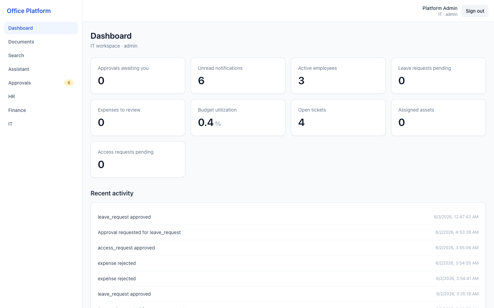 | 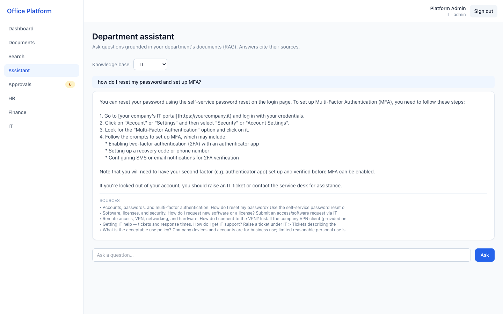 |

| Documents (upload + OCR + delete) | Semantic search |
| --- | --- |
| 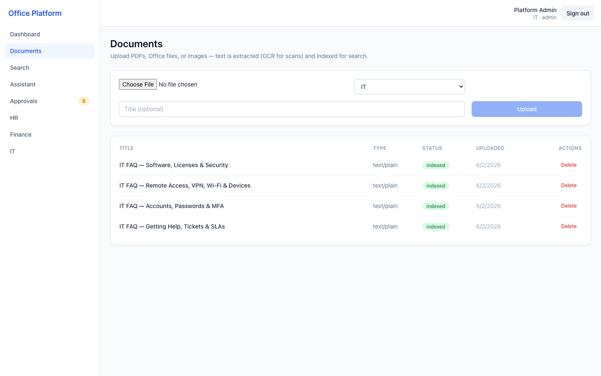 | 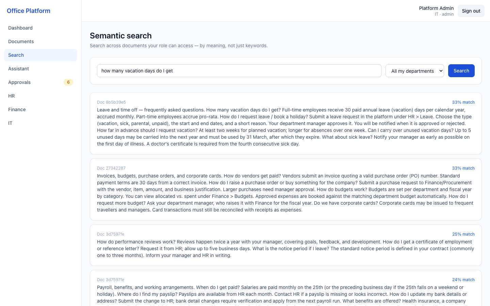 |

| Approvals queue | HR — leave request |
| --- | --- |
| 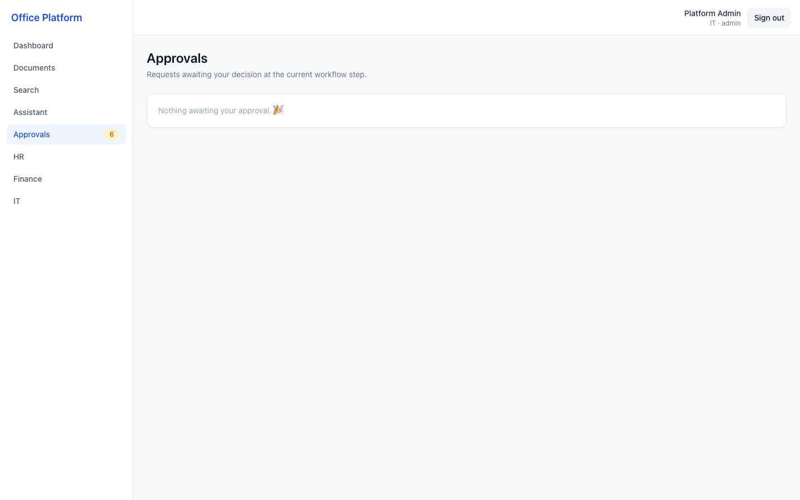 | 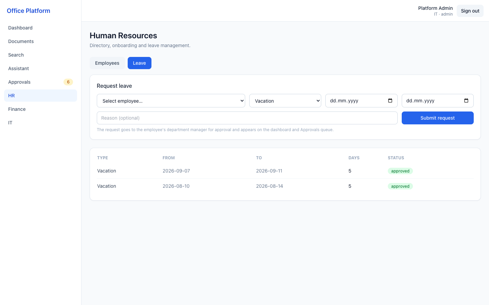 |

| HR — directory | Finance — expenses & budgets |
| --- | --- |
| 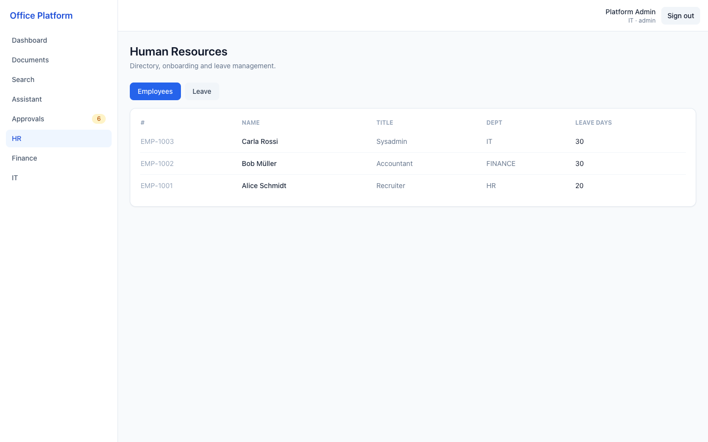 | 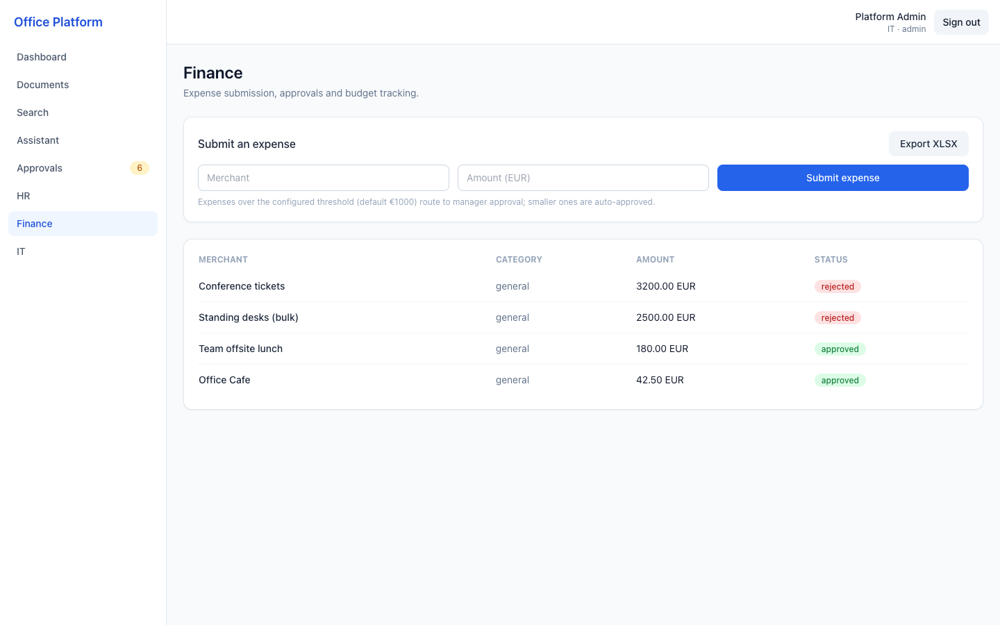 |

| IT — tickets / assets / access | Sign in |
| --- | --- |
| 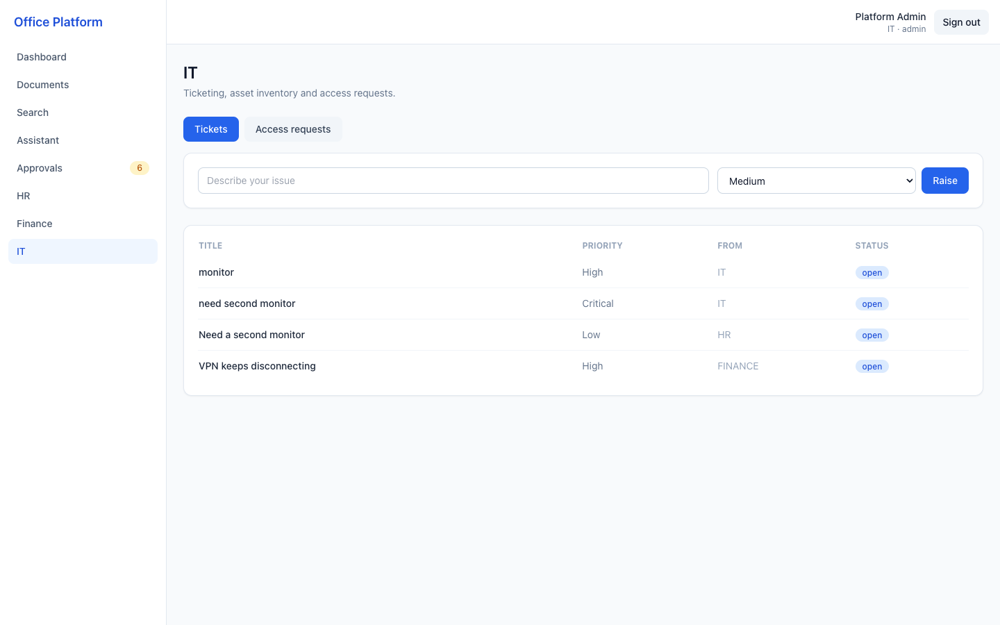 | 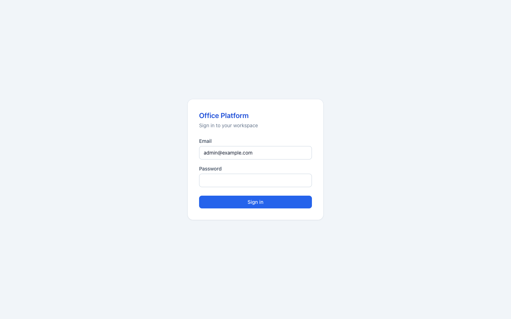 |

<p align="center">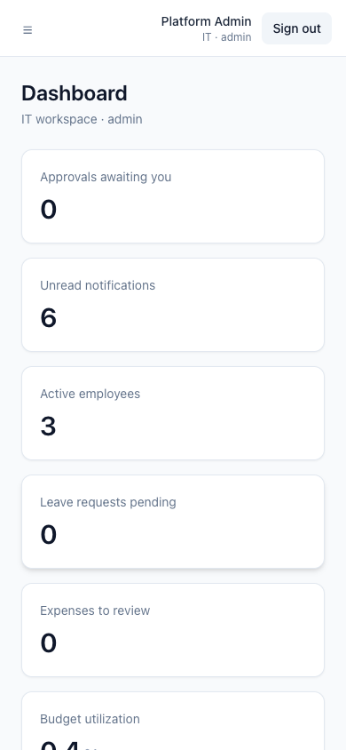<br><em>Fully responsive — mobile dashboard</em></p>

---

## Table of contents

- [Features](#features)
- [Architecture](#architecture)
- [Tech stack](#tech-stack)
- [The AI assistant (RAG) and LLM modes](#the-ai-assistant-rag-and-llm-modes)
- [Auth & RBAC](#auth--rbac)
- [Department modules](#department-modules)
- [Cross-cutting features](#cross-cutting-features)
- [Project structure](#project-structure)
- [Getting started](#getting-started)
- [Demo accounts](#demo-accounts)
- [Testing](#testing)
- [Deployment](#deployment)
- [Security & hardening](#security--hardening)

---

## Features

- **Auth & RBAC** — JWT access tokens with **refresh-token rotation and reuse
  detection**, Argon2id password hashing, four role tiers (admin → manager →
  member → viewer) and department-scoped permissions.
- **Multimodal document ingestion** — upload PDF / DOCX / XLSX / images; text is
  extracted (Tesseract **OCR** for scans), chunked, embedded, and indexed — all
  in the background so requests stay fast.
- **Semantic + full-text search** — pgvector cosine similarity and Postgres
  `tsvector`, scoped to what the caller is allowed to see.
- **Department AI assistant (RAG)** — answers grounded in a department's own
  documents, with cited sources and a prompt-injection guard. Pluggable LLM:
  **local (Ollama, free)**, **cloud (Anthropic)**, or an **extractive fallback**.
- **Configurable multi-step approval engine** — declarative, injection-safe
  triggers (e.g. *expense > €1000 needs manager + admin sign-off*); department
  modules plug in finalizers to apply the side effect on approval.
- **Role-aware dashboard**, notifications, and a cross-department activity feed.
- **Reports** — export expenses/budgets to **XLSX and PDF**.
- **Production concerns** — structured JSON logs, Prometheus metrics, optional
  OpenTelemetry tracing + Sentry, health/readiness probes, Redis rate limiting,
  security headers, soft deletes + an append-only audit log, Alembic migrations.

## Architecture

A **modular monolith** (FastAPI) with a React SPA. Heavy work (OCR, parsing,
embeddings) is offloaded to **Celery** workers. PostgreSQL is the single source
of truth, with **pgvector** co-located for semantic search — one datastore to
operate and back up, and transactional consistency between relational data and
embeddings.

```
                     ┌───────────────────────────┐
   Browser (SPA) ───▶│  nginx (serves SPA, /api → │
   React+TS+Tailwind │  reverse-proxy to API)     │
                     └─────────────┬──────────────┘
                                   │ JWT (access) + httpOnly refresh cookie
                     ┌─────────────▼──────────────┐      ┌──────────────────┐
                     │  FastAPI (async)            │─────▶│ PostgreSQL +      │
                     │  routers → services →       │      │ pgvector          │
                     │  repositories → models      │◀─────│ (relational +     │
                     │  RBAC · audit · rate-limit  │      │  embeddings)      │
                     └───────┬──────────────┬──────┘      └──────────────────┘
                  enqueue    │              │ cache / rate-limit / broker
                  ┌──────────▼───┐    ┌─────▼─────┐        ┌────────────────┐
                  │ Celery worker│    │  Redis     │        │ S3 / MinIO      │
                  │ OCR·parse·   │    └───────────┘        │ (docs; local    │
                  │ embed (RAG)  │──────────────┐          │  disk fallback) │
                  └──────────────┘              │          └────────────────┘
                                   ┌────────────▼───────────┐
                                   │ LLM provider (pluggable)│
                                   │ Ollama / Anthropic / echo│
                                   └─────────────────────────┘
```

The backend layering keeps concerns separated and testable:
`routers` (HTTP) → `services` (business logic) → `repositories` (data access) →
`models` (ORM). Each department lives in a pluggable `app/modules/<dept>/`.

## Tech stack

| Layer | Choice |
| --- | --- |
| Frontend | React 18, TypeScript, Vite, Tailwind CSS, TanStack Query, React Router |
| Backend | FastAPI, Pydantic v2, SQLAlchemy 2.0 (async), Alembic |
| Data | PostgreSQL 16 + pgvector; Redis |
| Async jobs | Celery |
| AI | sentence-transformers (`all-MiniLM-L6-v2`); pluggable LLM (Ollama / Anthropic) |
| Storage | S3-compatible (MinIO) with a local-disk fallback |
| Infra | Docker, docker-compose, Helm, GitHub Actions |
| Quality | ruff, black, mypy, ESLint, pytest |

## The AI assistant (RAG) and LLM modes

Every department has an assistant grounded in **that department's documents**.
A question is embedded, the most relevant chunks are retrieved from pgvector
(scoped by RBAC), and an answer is produced from that context with sources
cited. The LLM is a **pluggable provider** chosen with one env var:

| `LLM_PROVIDER` | What it does | Cost |
| --- | --- | --- |
| `ollama` | Generates real, conversational answers from a **local** model (e.g. `llama3.2`). Fully offline. | Free |
| `anthropic` | Highest-quality answers via the Claude API. Requires `ANTHROPIC_API_KEY`. | Paid usage |
| `echo` | No LLM — returns the most relevant Q&A snippet extracted from the docs. Always available. | Free |

If the configured provider is unavailable (no key, server down), the assistant
falls back to `echo` so the endpoint never hard-fails. Answers are always
constrained to retrieved context, with an instruction to ignore instructions
embedded inside documents (basic prompt-injection defense).

## Auth & RBAC

- **Tokens:** short-lived JWT access tokens carry identity + role claims (no DB
  hit per request); refresh tokens are opaque, stored only as hashes, and
  **rotated** on every use. Replaying a rotated token triggers **reuse
  detection** that revokes the whole token family — bounding the blast radius of
  a stolen token. The refresh token is delivered as an `httpOnly`,
  `SameSite=strict` cookie.
- **Two-dimensional authorization:** a **role tier** (admin > dept_manager >
  dept_member > viewer) decides *what* you can do; your **department** decides
  *whose* data you can touch. Admins are org-wide.
- Passwords are hashed with **Argon2id** and transparently re-hashed when params
  change.

## Department modules

Each module is pluggable (`app/modules/<dept>/` with its own models, schemas,
service, and router) and integrates with the shared approval engine.

- **HR** — employee directory, onboarding checklists, and **leave requests**
  (routed to the employee's department manager for approval; balances are
  deducted on approval).
- **Finance** — **expenses** (with receipts; small ones auto-approve, large ones
  route to multi-step approval and book against the matching **budget**),
  **invoices**, and **budget dashboards**. Export to XLSX/PDF.
- **IT** — **tickets** (with priorities & SLAs in the knowledge base), **asset
  inventory**, and **access requests** (always routed through approval).

## Cross-cutting features

- **Approval engine** — reusable workflows per `(department, resource_type)` with
  declarative triggers; running requests advance step-by-step, with row locking
  to serialize concurrent decisions. Modules register *finalizers* so the engine
  applies the side effect (mark leave approved, book the expense) without the
  engine importing module code.
- **Notifications & activity feed** — approvers are notified of pending items; a
  department-scoped feed records notable events.
- **Audit log** — an append-only record of every mutating request (actor, action,
  path, status, IP, request id), written on an independent transaction so it
  survives even a failed request.
- **Reports** — generate XLSX/PDF in-memory and stream them back.

## Project structure

```
backend/
  app/
    core/         config, security, logging, telemetry, deps, rate-limit
    db/           async engine/session, base + mixins (UUID, timestamps, soft delete)
    models/       SQLAlchemy ORM (+ pgvector)
    schemas/      Pydantic v2 request/response models
    repositories/ data access (soft-delete aware, paginated)
    services/     business logic (auth, rbac, approvals, ingestion, rag, llm, …)
    routers/      HTTP endpoints
    modules/      pluggable departments: hr/, finance/, it/
    workers/      Celery app + tasks
    middleware/   request context, security headers, audit
  migrations/     Alembic
  tests/          unit / integration / e2e (+ fixtures)
  scripts/        entrypoint, demo + knowledge-base loaders
frontend/         React + TS + Tailwind SPA
deploy/           compose (prod), Helm chart, runbook
docs/             OpenAPI export + screenshots
.github/workflows ci.yml
```

## Getting started

### Quickstart (Docker Compose)

Brings up Postgres+pgvector, Redis, MinIO, the API, a Celery worker, and the SPA:

```bash
docker compose up --build
# seed roles, demo users, and default approval workflows:
docker compose exec api python -m app.initial_data
```

- SPA: http://localhost:8080
- API docs (Swagger): http://localhost:8000/docs

### Run the backend without Docker

```bash
cd backend
python -m venv .venv && source .venv/bin/activate
pip install -e ".[full,dev]"
cp .env.example .env            # then edit
alembic upgrade head
python -m app.initial_data
uvicorn app.main:app --reload
# worker (separate shell):
celery -A app.workers.celery_app.celery_app worker --loglevel=info
```

### Run the frontend

```bash
cd frontend
npm install
npm run dev        # http://localhost:5173 (proxies /api to :8000)
```

### Optional: free local LLM answers

```bash
brew install ollama && brew services start ollama
ollama pull llama3.2:3b
# point the API at it:
export LLM_PROVIDER=ollama OLLAMA_MODEL=llama3.2:3b
```

## Demo accounts

After seeding (`python -m app.initial_data`):

| Role | Email | Password |
| --- | --- | --- |
| Admin (org-wide) | `admin@example.com` | `ChangeMe!Admin123` |
| Manager (per dept) | `hr.manager@example.com`, `finance.manager@example.com`, `it.manager@example.com` | `ChangeMe!Mgr123` |
| Member (per dept) | `hr.member@example.com`, `finance.member@example.com`, `it.member@example.com` | `ChangeMe!Mem123` |

> These are **local demo defaults** — change them (and `JWT_SECRET`) before any
> real deployment. See the [runbook](deploy/runbook.md).

Optional: load realistic content/data with
`python scripts/load_knowledge_base.py` and `python scripts/load_demo_data.py`.

## Testing

```bash
cd backend
pip install -e ".[dev]"
pytest                 # unit tests always run
```

Integration + e2e tests run automatically when a Postgres/pgvector test DB is
reachable (they exercise the real auth flow, the approval engine end-to-end, and
upload → ingest → search → chat); otherwise they're skipped. Quality gates:
`ruff check app tests`, `black app tests`, `mypy app`, and `npm run lint`/`typecheck`/`build`
for the frontend — all run in CI on every push ([.github/workflows/ci.yml](.github/workflows/ci.yml)).

## Deployment

- **Single host** → [deploy/compose/docker-compose.prod.yml](deploy/compose/docker-compose.prod.yml)
- **Kubernetes** → [deploy/helm/office-platform](deploy/helm/office-platform) (API + worker + frontend, HPA, ingress, and a pre-upgrade migration hook)

Both are documented step-by-step — with rollback and backup/restore — in the
**[Operations Runbook](deploy/runbook.md)**.

**CI/CD** (GitHub Actions):
- **CI** ([ci.yml](.github/workflows/ci.yml)) — on every push/PR: ruff + black + mypy, the pytest suite against real Postgres + pgvector + Redis, frontend lint/type-check/build, a Trivy + pip-audit security scan, Helm lint, and a Docker image build.
- **CD** ([cd.yml](.github/workflows/cd.yml)) — on push to `main` and version tags: builds and publishes versioned **backend + frontend images to GHCR**, then offers a manual, environment-gated **Helm deploy** to a cluster.

## Security & hardening

Implemented: input validation (Pydantic), parameterized queries (SQLAlchemy),
refresh-token rotation + reuse detection, Argon2id, security headers, CORS
allow-list, Redis-backed rate limiting, an append-only audit log, soft deletes,
injection-safe approval triggers, a RAG prompt-injection guard, non-root
containers, and health/readiness probes.

Before a real go-live, see the hardening checklist in the
[runbook](deploy/runbook.md#hardening-checklist): wire a real secrets manager,
encrypt PII at rest (HR ID docs / receipts), tune the pgvector index for corpus
size, scope object-storage IAM, gate dependency scanning, add a WAF/CDN + TLS,
and load-test the embedding workers.
